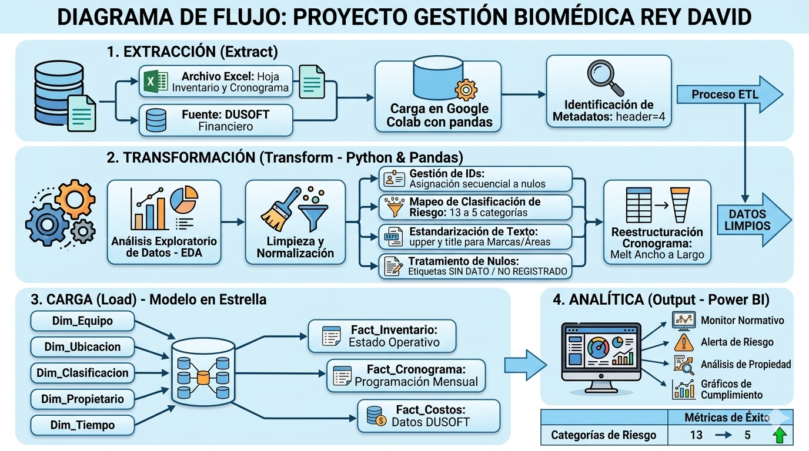
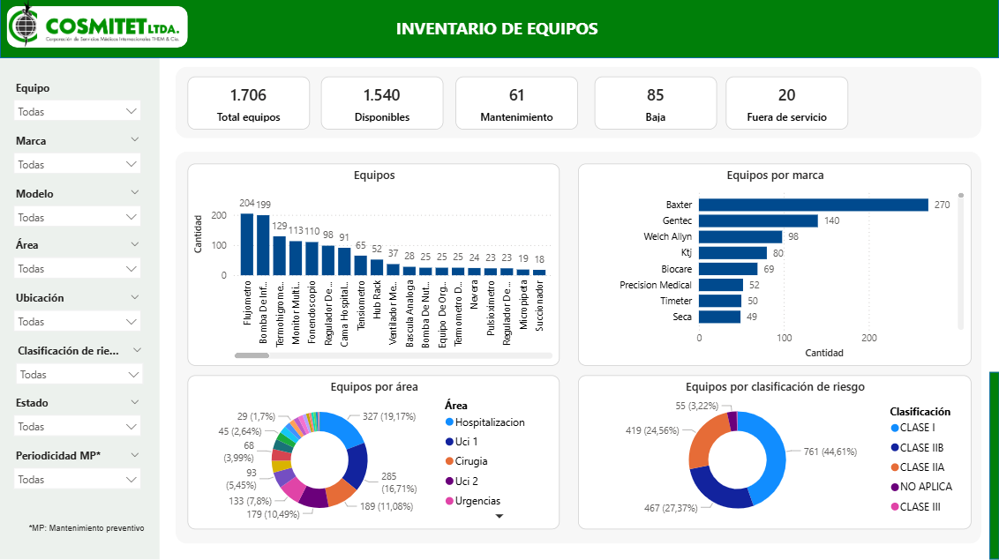
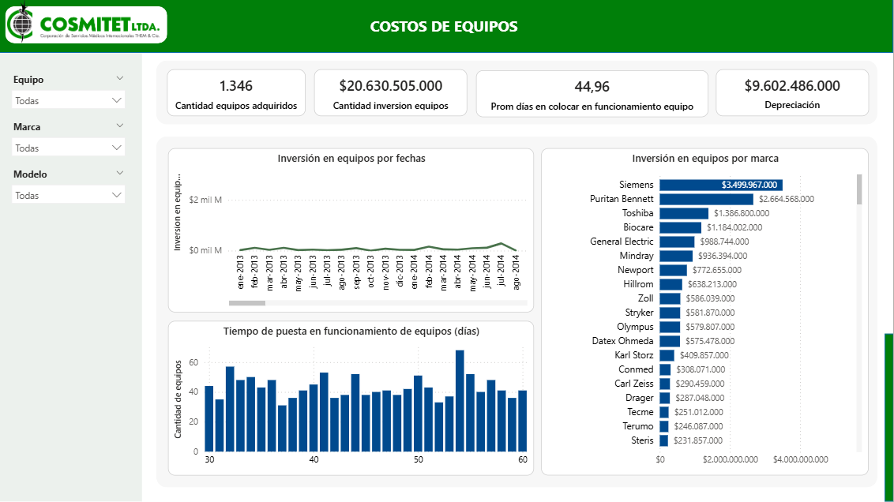
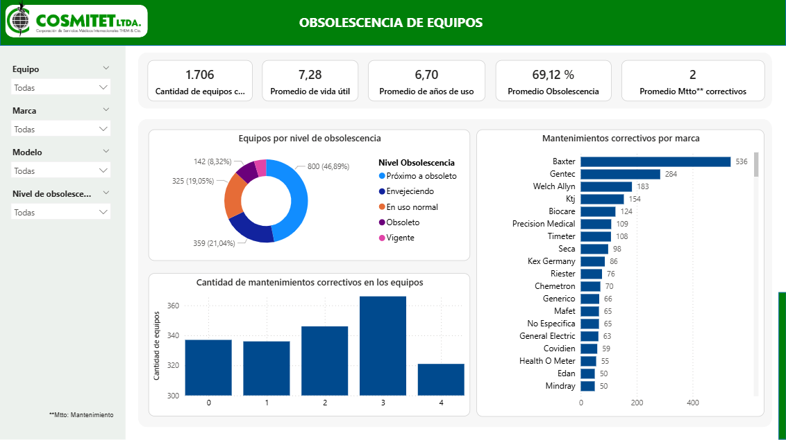

# 🏥 Proyecto Gestión Biomédica – Clínica Rey David

## 📊 Diagrama de Flujo del Proyecto

---

## 📌 Descripción del Proyecto
La gestión de la tecnología biomédica en instituciones de salud es clave para garantizar la calidad del servicio, la seguridad del paciente y el cumplimiento de la normativa. Los equipos biomédicos, al participar en procesos diagnósticos y terapéuticos, deben operar en condiciones óptimas, lo cual depende de una adecuada planificación, seguimiento y control de mantenimientos y calibraciones. Por ello, no solo es importante llevar un inventario, sino contar con información confiable que permita anticipar riesgos y apoyar la toma de decisiones.

Actualmente, en la Clínica Rey David esta gestión se realiza mediante archivos de Excel que contienen el inventario y los cronogramas de mantenimiento y calibración. Aunque estos archivos incluyen información relevante, presentan limitaciones en su organización, estandarización y capacidad de análisis.

El manejo manual de la información ha generado varios problemas. La información se encuentra dispersa y sin una estructura uniforme, lo que dificulta su actualización e integración. Esto ocasiona inconsistencias, duplicidad de datos y errores, afectando la calidad de la información. Además, la falta de controles adecuados limita la trazabilidad de los equipos durante su ciclo de vida, dificultando el seguimiento de mantenimientos y estados operativos.

Por otra parte, la gestión de los cronogramas de mantenimiento preventivo se ve afectada por la falta de herramientas que permitan un monitoreo sistemático y oportuno. Esto puede generar retrasos en la ejecución de actividades críticas, incrementando el riesgo de fallas en los equipos y, en consecuencia, posibles afectaciones en la atención de los pacientes. Asimismo, la falta de visibilidad sobre el estado de calibración de los equipos compromete el cumplimiento de requisitos normativos, lo cual puede derivar en observaciones durante procesos de auditoría o habilitación.

En este sentido, se hace evidente la necesidad de fortalecer la gestión de la tecnología biomédica mediante la implementación de un enfoque estructurado que permita organizar, integrar y analizar la información disponible. La transición desde un manejo operativo basado en registros manuales hacia un modelo que facilite la generación de información confiable y oportuna resulta fundamental para mejorar la eficiencia, garantizar el cumplimiento normativo y apoyar la toma de decisiones estratégicas dentro de la institución.

---

## ⚙️ Pipeline de Datos (ETL)

### 1. 📥 Extracción (Extract)

Se configuró el entorno de trabajo en Python mediante las librerías pandas, numpy, matplotlib y seaborn. Durante la carga del archivo principal, se identificó que las primeras filas correspondían a metadatos y a la leyenda del documento, por lo que los encabezados reales no se encontraban en la primera fila. Este hallazgo llevó a ajustar los parámetros de lectura para interpretar correctamente la estructura del archivo.

El dataset resultante presenta una organización en dos bloques principales: información de inventario de equipos y cronograma de mantenimiento, lo que permitió diferenciar claramente las dos naturalezas de datos contenidas en la misma fuente.

De manera complementaria, se incorporó el dataset proveniente del sistema financiero DUSOFT, correspondiente a activos fijos, el cual fue suministrado en formato Excel. Al igual que en la fuente principal, se identificaron inconsistencias en la calidad de los datos, tales como diferencias en formatos, variaciones en la nomenclatura de columnas y posibles irregularidades en los registros.

Estas similitudes evidencian problemas estructurales comunes en la gestión de la información, lo que refuerza la necesidad de implementar procesos de estandarización, limpieza y transformación de datos que garanticen su calidad y confiabilidad.

---

### 2. EDA

## Calidad de datos

Esta fase constituyó uno de los hallazgos más relevantes del análisis. Se generó un mapa visual de valores nulos codificado por color (azul para menos del 5 %, naranja para entre 5 % y 30 %, y rojo para más del 30 %), lo que permitió identificar de manera clara la concentración de datos faltantes.

En cuanto a registros duplicados, se detectaron 50 casos con combinación idéntica de equipo, marca, modelo y serie. Esta situación puede deberse a la existencia de equipos genéricos sin número de serie único (como fonendoscopios o termómetros) o a errores de digitación.

Asimismo, se identificaron inconsistencias graves de estandarización en múltiples columnas categóricas. La variable CLASIFICACIÓN DE RIESGO presenta 13 variantes distintas para representar únicamente 4 categorías reales (por ejemplo, “CLASE I”, “Clase I” e “I” hacen referencia al mismo valor). De manera similar, PERIODICIDAD MP contiene 14 variantes para 6 categorías (por ejemplo, “Anual”, “anual”, “ANUAL”). La columna MARCA evidencia inconsistencias en la capitalización (“Baxter”, “baxter”, “BAXTER”), mientras que ENCARGADO MTTO MP presenta múltiples grafías para un mismo proveedor (“SUKHI”, “sukhi”, “Sukhi”).

Estas inconsistencias distorsionan los conteos, dificultan la correcta agregación de datos y generan redundancia artificial en la cardinalidad de las variables, afectando directamente la calidad del análisis.

## Análisis univariado

Se analizó la distribución individual de las principales variables del inventario mediante gráficas de barras y diagramas de torta. Los hallazgos más relevantes se resumen a continuación:

En cuanto al estado operativo, el 90,3 % de los equipos se encuentran en estado DISPONIBLE (1.540 registros), el 5,0 % están en BAJA (85 equipos) y el 1,2 % se encuentran FUERA DE SERVICIO (20 equipos), con un 3,6 % sin estado registrado.

Respecto a la clasificación de riesgo (con valores sin depurar), la categoría más frecuente es CLASE I, con más de 500 equipos, seguida de CLASE IIB y CLASE IIA. Sin embargo, el 27,3 % de los registros carece de esta información crítica.

En la distribución por tipo de equipo, los más numerosos son los flujómetros (204), las bombas de infusión (199) y los termohigrómetros (128), todos críticos para la operación hospitalaria.

Por área, Hospitalización concentra el mayor número de equipos (321), seguida de Cirugía (181), UCI 2 (177) y UCI 1 (173).

En cuanto a la propiedad, Cosmitet Ltda. es responsable del 79 % del inventario (aproximadamente 1.346 equipos), mientras que Baxter posee el 17,5 % (cerca de 300 equipos), lo que evidencia una alta concentración en un único proveedor.

## Análisis bivariado y multivariado

Se exploraron las relaciones entre variables mediante tablas de contingencia y visualizaciones cruzadas.

El cruce entre Clasificación de Riesgo y Estado reveló que los equipos FUERA DE SERVICIO se concentran en las categorías CLASE IIA y CLASE IIB, que corresponden a niveles de mayor riesgo clínico. Este hallazgo representa una señal de alerta operativa significativa para la institución.

El análisis de Área vs. Estado, mediante gráficas de barras apiladas, mostró que UCI 1, UCI 2 y Cirugía presentan la mayor proporción de equipos en estado BAJA, lo que podría indicar procesos activos de renovación tecnológica en áreas críticas.

Finalmente, el análisis mediante mapa de calor entre Propietario y Encargado de Mantenimiento confirmó que Baxter gestiona exclusivamente sus propios equipos bajo un modelo de comodato con servicio integrado, mientras que Cosmitet Ltda. delega el mantenimiento principalmente a SUKHI y a su propio equipo técnico.

En relación con el dataset de activos fijos, se identificó la presencia de registros duplicados, lo cual representa un problema significativo en la calidad de la información. Estos duplicados pueden originarse por errores en la digitación, ausencia de controles en el ingreso de datos o falta de criterios únicos de identificación para cada activo.

La existencia de registros duplicados afecta directamente la confiabilidad del análisis, ya que puede generar sobreestimaciones en el inventario, inconsistencias en la trazabilidad de los equipos y errores en la gestión contable y operativa.

### 3. 🔄 Transformación (Transform – Python & Pandas)
## Inventario Biomédico
Una vez extraído el archivo Excel de inventario, el proceso de transformación comenzó con la selección del rango de datos relevante, descartando las filas de encabezado institucional y conservando únicamente las 14 columnas operativas, a las cuales se les asignaron nombres estandarizados: ID, EQUIPO, MARCA, MODELO, SERIE, ACTIVO_FIJO, AREA, UBICACION, REGISTRO_SANITARIO, CLASIFICACION_RIESGO, ESTADO, PROPIETARIO_EQUIPO, ENCARGADO_MTTO_MP y PERIODICIDAD_MP.
El primer paso fue una limpieza general de texto, eliminando saltos de línea, tabulaciones y espacios múltiples en todos los campos, convirtiendo los valores resultantes vacíos en NaN para su tratamiento posterior.
A continuación se abordó la reconstrucción del campo ID. Dado que el inventario original presentaba identificadores con inconsistencias o valores nulos, se conservó el valor original en una columna auxiliar ID_ORIGINAL, se ordenaron los registros por su valor numérico y se asignó una numeración secuencial limpia de 1 hasta N, garantizando la integridad referencial del dataset.
Uno de los procesos más extensos fue la normalización de marcas y equipos. El campo MARCA presentaba más de 80 variantes ortográficas para referirse a los mismos fabricantes — mezcla de mayúsculas, minúsculas, abreviaciones y errores tipográficos — por lo que se construyó un diccionario de mapeo que unificó todas las variantes bajo un nombre canónico (por ejemplo, GE, General electric y GEneral electric se consolidaron en General Electric; BIOMERIEUX en bioMerieux; ZOLL y zoll en Zoll). El mismo tratamiento se aplicó al campo EQUIPO, corrigiendo errores de capitalización y tipografías irregulares como ElectroBisturi → Electrobisturi o CaBina de Seguridad Biologica → Cabina de Seguridad Biologica.
En la normalización de campos categóricos, el campo CLASIFICACION_RIESGO pasó de tener 13 variantes distintas a quedar consolidado en 5 categorías limpias: CLASE I, CLASE IIA, CLASE IIB, CLASE III y No Aplica. El campo PERIODICIDAD_MP fue unificado en valores como ANUAL, SEMESTRAL, TRIMESTRAL, CUATRIMESTRAL, BIANUAL y N/A, eliminando variantes como Anual, anual o ANUALES. El campo ESTADO fue convertido a mayúsculas y estandarizado.
Para garantizar la compatibilidad técnica con Power BI y posibles bases de datos relacionales, se aplicó una eliminación de tildes y caracteres diacríticos mediante normalización Unicode (NFD) en todas las columnas de texto, convirtiendo caracteres como é, ó, ú, ñ a sus equivalentes sin acento.
El campo AREA fue sometido a un proceso de normalización de áreas hospitalarias, unificando variantes como Uci, Uci Adultos y UCIS bajo una clasificación consistente (UCI 1, UCI 2), y corrigiendo entradas como MTO BIOMEDICO o mto biomedico hacia Biomedico. De forma análoga, los campos PROPIETARIO_EQUIPO y ENCARGADO_MTTO_MP fueron normalizados mediante sus respectivos mapeos.
Finalmente, se realizó una imputación de valores nulos con etiquetas semánticas según el contexto de cada columna: los registros sin área asignada se marcaron como 'Biomedico', los sin estado como 'Mantenimiento', y el resto de campos (marca, modelo, serie, activo fijo, ubicación, registro sanitario, clasificación, propietario y encargado) se completaron con 'No especifica', evitando así registros incompletos que pudieran afectar los cálculos en el dashboard.

## Activos Fijos
El dataset de activos fijos siguió un proceso de transformación similar, comenzando por la estandarización de los nombres de columna al formato UPPER_SNAKE_CASE, eliminando espacios, puntos, porcentajes y caracteres con tilde en los encabezados para garantizar su correcta lectura programática.
Posteriormente se aplicó la misma rutina de limpieza general de texto y se procedió a la eliminación de registros duplicados por ID, consolidando el dataset en registros únicos. Se aplicaron los mismos mapeos de normalización de marcas y equipos, y se eliminaron las tildes de todos los valores de texto. El resultado final seleccionó 11 columnas orientadas al análisis financiero y de obsolescencia: ID, ID_EQUIPO, COSTO, FECHA_INGRESO, FECHA_INICIO_OP, PRECIO_DEPRECIACION, AÑOS_USO, VIDA_UTIL, OBSOLESCENCIA_PCT, NIVEL_OBSOLESCENCIA y MTO_CORRECTIVO.

## Creación de la Dimensión Dim_equipo
Como parte del diseño del modelo en estrella, se construyó la tabla de dimensión Dim_equipo directamente desde el proceso de transformación del inventario. Para ello, se extrajeron todas las combinaciones únicas de los campos EQUIPO, MARCA y MODELO, se ordenaron alfabéticamente y se les asignó un identificador numérico secuencial ID_EQUIPO como clave primaria.
Esta dimensión centraliza la información descriptiva de cada tipo de equipo biomédico, desacoplándola de la tabla de hechos y evitando la redundancia de datos. Una vez construida, se realizó un merge con el inventario principal usando (EQUIPO, MARCA, MODELO) como clave de unión, incorporando ID_EQUIPO como clave foránea en Fact_Inventario. El mismo proceso se replicó para el dataset de activos fijos, asegurando que ambas tablas de hechos compartan la misma dimensión de equipo y puedan relacionarse correctamente en el modelo de Power BI.

### 4. 🧩 Carga (Load – Modelo en Estrella)

#### 🔹 Dimensiones
- Dim_Equipo  
- Dim_Ubicacion  
- Dim_Clasificacion  
- Dim_Propietario  
- Dim_Tiempo  

#### 🔹 Tablas de Hechos
- Fact_Inventario  
- Fact_Cronograma  
- Fact_Costos  

---

## 📈 Transformaciones en Power BI

### 🔹 Fact_Inventario

**Fuente:** inventario_estandarizado.csv  

Transformaciones:

1. Promoción de encabezados  
2. Cambio de tipos de datos  
3. Eliminación de columnas innecesarias  
4. Formato Proper  
5. Formato Upper  
6. Upper + Proper  

---

### 🔹 Dim_Equipo

**Fuente:** dim_equipo.csv  

Transformaciones:

1. Promoción de encabezados  
2. Tipos de datos  
3. Formato Proper  
4. Formato Upper  

---

### 🔹 Tabla de Medidas (Measure)

Se crea una tabla independiente para centralizar todas las medidas DAX.

Beneficios:
- Organización del modelo  
- Mejor mantenimiento  
- Escalabilidad  

---

### 🔹 Fact_Precio_Obsolescencia

**Fuente:** Activos_Fijos_Data.csv  

Transformaciones:

1. Promoción de encabezados  
2. Tipos de datos  
3. Join con Fact_Inventario (Left Join)  
4. Expansión de columnas  
5. Renombrado de campos  

---

## 📊 Dashboards Desarrollados

### 🧾 Inventario
- Estado operativo  
- Distribución por área  
- Clasificación de riesgo  

### 💰 Costos de Equipos
- Costos de mantenimiento  
- Análisis financiero  

### ⚠️ Obsolescencia
- Vida útil  
- Índice de obsolescencia  
- Priorización de renovación  

---

## 🔗 Visualización del Dashboard

👉 https://app.powerbi.com/view?r=eyJrIjoiZjg0OGM2ZDMtYWE5OC00ODU2LWExYTctOWUzNThjOTJlOTk4IiwidCI6IjY5M2NiZWEwLTRlZjktNDI1NC04OTc3LTc2ZTA1Y2I1ZjU1NiIsImMiOjR9

- Power BI  
- ETL  
- Modelo de datos tipo estrella  
